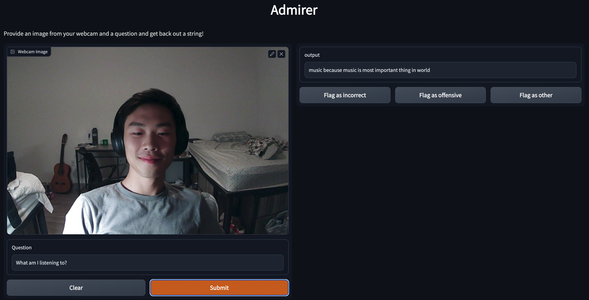
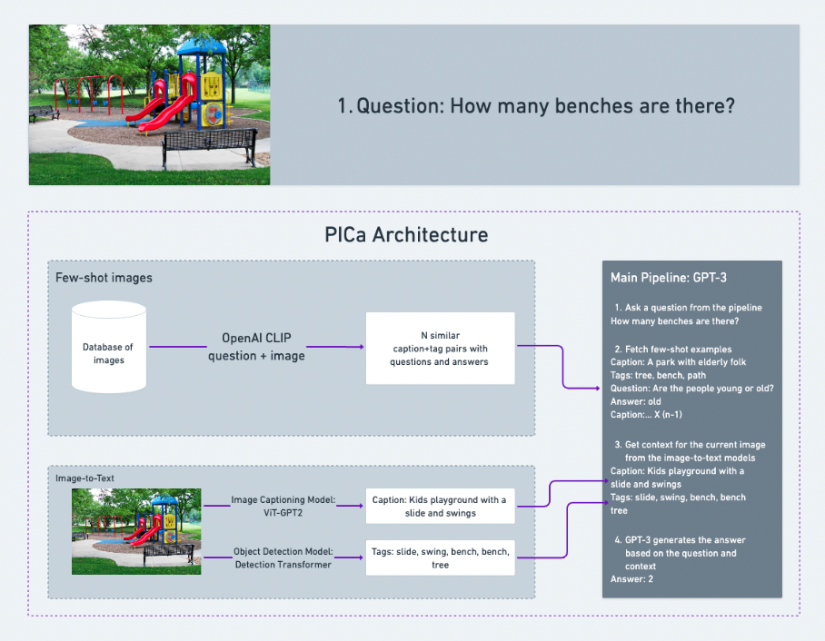

# [admirer](https://admirer.loca.lt/)


# Contents
- [The Transformees](#the-transformees)
- [Description](#description)
    - [Inference Pipeline](#inference-pipeline)
    - [Usage](#usage)
- [Production](#production)
- [Development](#development)
    - [Setup](#setup)
    - [Repository Structure](#repository-structure)
    - [Testing](#testing)
- [Credit](#credit)

# The Transformees
1. [Andrew Hinh](https://github.com/andrewhinh)
2. [Aleks Hiidenhovi](https://github.com/alekshiidenhovi)

# Description
- A full-stack ML-powered website that utilizes users’ webcam feeds to answer open-ended questions requiring outside knowledge.
- Andrew built the MVP of the website as a [top-25 final project](https://bit.ly/3h8CqlX) for the [FSDL 2022 course](https://bit.ly/3NYNf6v), writing only the deployment code. [The Transformees](#the-transformees) continued the project for the [ZenML Month of MLOps Competition](https://bit.ly/3EmoCxv) and won the `Most Promising Entry` prize in the [closing ceremony](https://bit.ly/3VCZqsl). We wrote the data management, model development, testing, and continual learning scripts in the allotted time.

## Inference Pipeline


The visual question-answering pipeline is inspired by the paper from Microsoft linked in the [credit section](#credit). In short, we prompt GPT-3 with a generated image caption and object tag list, the question-answer pair, and context examples that demonstrate the task at hand in a few-shot learning method, achieving a [BERTScore](http://bit.ly/3tM1mmc) computed F1 score of around .989 on the test set.

## Usage
As a direct consequence of not feeding the image data directly to GPT-3, the best queries involve asking descriptive, counting, or similar questions about one or more objects visible in the background. For example, if there are two people in the image, one wearing a hat and the other wearing glasses, questions that would work well could include the following:
- "How many people are in the room?"
- "What color is the hat in the picture?"
- "How many people are wearing glasses?"

# Production
To setup the production server for the website in an AWS EC2 instance, we:
1. Setup the instance: install packages such as `pip`, pull the repo, and install the environment requirements:
2. Setup the Gradio app with an AWS Lambda backend:
```bash
python3 app_gradio/app.py --flagging --model_url=https://joiajq6syp65ueonto4mswttzu0apfbi.lambda-url.us-west-1.on.aws/
```
3. Serve the Gradio app over a permanent localtunnel link:
```bash
. ./backend_setup/localtunnel.sh
```
4. Implement continual development by updating the AWS Lambda backend when signaled by a pushed commit to the repo and checking if the BERTScore computed F1 score of the pipeline has improved:
```bash
. ./backend_setup/cont_deploy.sh
```

# Development
## Setup
1. Follow the steps listed [here](https://github.com/full-stack-deep-learning/fsdl-text-recognizer-2022-labs/tree/main/setup#local), replacing the corresponding commands with:
```bash
git clone https://github.com/andrewhinh/admirer.git
cd admirer
conda activate admirer
```
2. If you're using a newer NVIDIA RTX GPU, uninstall PyTorch and visit [here](https://pytorch.org/get-started/locally/) to download the PyTorch version that is compatible with your machine:
```bash
pip3 uninstall torch torchvision torchaudio -y
```
3. Sign up for OpenAI's API [here](https://openai.com/api/), populate a `.env` file with your OpenAI API key in the format of `.env.template`, and reactivate (just activate again) the environment.
4. Sign up for an AWS account [here](https://us-west-2.console.aws.amazon.com/ecr/create-repository?region=us-west-2) and setup your AWS credentials locally, referring to [this](https://docs.aws.amazon.com/cli/latest/userguide/cli-configure-quickstart.html#cli-configure-quickstart-config) as needed:
```bash
aws configure
```
5. Sign up for a Weights and Biases account [here](https://wandb.ai/signup) and download the models and context examples locally:
```bash
wandb login
python ./training/stage_model.py --fetch --from_project admirer
```
## Repository Structure
The repo is separated into main folders that each describe a part of the ML-project lifecycle, some of which contain interactive notebooks, and supporting files and folders that store configurations and workflow scripts:
```bash
.
├── api_serverless  # the backend handler code using AWS Lambda.
├── app_gradio      # the frontend code using Gradio.
├── backend_setup   # the AWS Lambda backend setup and continuous deployment code.
├── data_manage     # the data management code using AWS S3 for training data and ZenML log storage, boto3 for data exploration, and ZenML + Great Expectations for data validation.
├── load_test       # the load testing code using Locust.
├── monitoring      # the model monitoring code using Gradio's flagging feature.
├── question_answer # the inference code.
├── tasks           # the pipeline testing code.
├── training        # the model development code using PyTorch, PyTorch Lightning, and Weights and Biases.
```
## Testing
From the main directory, there are various ways to test the pipeline:
- To start a W&B hyperparameter optimization sweep for the caption model (on one GPU):
```bash
. ./training/sweep/sweep.sh
CUDA_VISIBLE_DEVICES=0 wandb agent --project ${PROJECT} --entity ${ENTITY} ${SWEEP_ID}
```
- To train the caption model (add `--strategy ddp_find_unused_parameters_false` for multi-GPU machines; takes ~7.5 hrs on an 8xA100 Lambda Labs instance):
```bash
python ./training/run_experiment.py \
--data_class PICa --model_class ViT2GPT2 --gpus "-1" \
--wandb --log_every_n_steps 25 --max_epochs 300 \
--augment_data True --num_workers "$(nproc)" \
--batch_size 2 --one_cycle_max_lr 0.01 --top_k 780 --top_p 0.65 --max_label_length 50
```
- To test the caption model (best model can be downloaded from [here](https://wandb.ai/admirer/admirer-training/artifacts/model/model-2vgqajre/v4/files)):
```bash
python ./training/test_model.py \
--data_class PICa --model_class ViT2GPT2 \
--num_workers "$(nproc)" --load_checkpoint training/model.pth
```
- To start the Gradio app locally:
```bash
python app_gradio/app.py --flagging
```
- To test the Gradio frontend by launching and pinging the frontend locally:
```bash
python -c "from app_gradio.tests.test_app import test_local_run; test_local_run()"
```
- To test the caption model's ability to memorize a single batch:
```bash
. ./training/tests/test_memorize_caption.sh
```
- To test various aspects of the model pipeline:
```bash
. ./tasks/REPLACE #replacing REPLACE with the corresponding shell script in the tasks/ folder
```

# Credit
- GI4E for their [database](https://www.unavarra.es/gi4e/databases/gi4e/?languageId=1) and [Scale AI](https://scale.com/) for their annotations.
- Facebook for their [image segmentation model](https://huggingface.co/facebook/detr-resnet-50-panoptic).
- NLP Connect for their [base image caption model](https://huggingface.co/nlpconnect/vit-gpt2-image-captioning) and Sachin Abeywardana for his [fine-tuning code](https://sachinruk.github.io/blog/pytorch/huggingface/2021/12/28/vit-to-gpt2-encoder-decoder-model.html).
- OpenAI for their [CLIP text and image encoder code](https://huggingface.co/openai/clip-vit-base-patch16) and [GPT-3 API](https://openai.com/api/).
- Microsoft for their [visual question answering code](https://github.com/microsoft/PICa).
